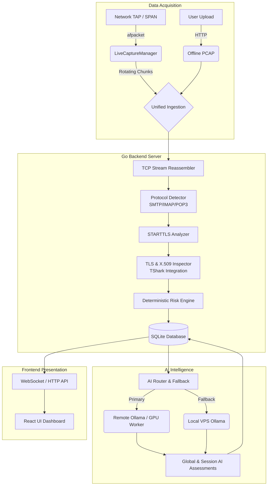
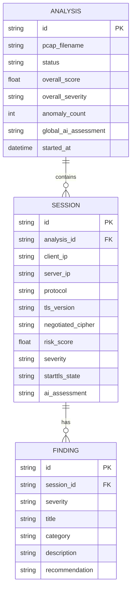

# SecureMailScope

**AI-Assisted Cryptographic Security Posture Assessment for Secure Email Communications**

> **SIH 2026 — Problem Statement 26159 | National Technical Research Organisation (NTRO)**

SecureMailScope is a completely passive network monitor and forensic artifact analyzer. It requires **NO inline redirection** of mail traffic and operates entirely out-of-band using standard PCAP analysis or a Live TAP/SPAN capture feed. It combines deterministic cryptographic risk assessment with advanced AI reasoning to uncover vulnerabilities in email infrastructure (SMTP, IMAP, POP3) without compromising confidentiality.

---

## 🏗️ System Architecture

SecureMailScope uses a **unified analytic brain**, meaning an offline uploaded PCAP and a live captured TCP stream run through the exact same deep-inspection pipeline.



---

## 🗄️ Database Schema (ERD)

The system relies on a relational schema designed for forensic data retrieval and AI correlation.



---

## 🚀 Docker Deployment (Production)

The entire application runs inside a multi-stage Docker container utilizing host networking to safely access the Linux kernel's capture interfaces without risking full system compromise.

### 1. Requirements

- Docker & Docker Compose
- Linux Host (Required for `network_mode: "host"` and `afpacket` TAP/SPAN capture)
- Optional: Virtual TAP device or physical SPAN port.

### 2. Quick Start

Run the complete platform with a single command:

```bash
docker compose up -d --build
```

Access the dashboard natively on the host:
**http://localhost:6000**

---

## ⚙️ Modes of Operation

#### 📂 Offline Mode (Forensic PCAP)
1. Go to **Upload PCAP** in the dashboard.
2. Submit your `.pcap` or `.pcapng` evidence file.
3. Review deterministic rules, AI analysis, and forensic findings in the **Analyses** tab.

#### 📡 Live Sensor Mode (TAP/SPAN)
1. Setup a TAP interface (e.g. `tap0`) or a SPAN-mirrored physical interface (`eth1`).
2. Open the **Live Sensor** dashboard tab.
3. Select your interface and click **Start Capture**.
4. Traffic is captured, processed in chunks, and fed in real-time to the UI.

---

## ⚠️ Live Capture Limitations (Cross-Chunk Streaming)

Currently, Live Sensor Mode operates by buffering captured packets into rotating `.pcap` files (e.g., chunks of 10 seconds, configured via `CAPTURE_CHUNK_SECONDS`) and passing these chunks through the robust offline forensic pipeline.

**Limitation:** Because chunks are analyzed independently, long-lived TCP sessions that span across multiple chunk boundaries are analyzed as separate sessions. This is a deliberate design choice that prevents silent packet loss at boundaries and allows the live engine to reuse the deterministic pipeline without holding unbounded stream reassembly state in memory.

---

## 🔌 Setting up a Live Capture Interface

**TAP Device (Software simulation/routing):**
```bash
sudo ip tuntap add dev tap0 mode tap
sudo ip link set dev tap0 up
```

**SPAN/Mirror Port (Hardware):**
```bash
sudo ip link set dev eth1 promisc on
```
*Note: SecureMailScope acts passively. Traffic MUST be routed to your chosen interface via network/switch configuration.*

---

## 🔧 Environment Variables & Data Persistence

See `.env.example` for defaults. All data is persisted securely via Docker volumes mapped to the `/data` directory:
- `/data/database/` (SQLite)
- `/data/captures/live/` (Rolling PCAPs)
- `/data/uploads/` (Offline PCAPs)

Key AI Router variables:
- `AI_REMOTE_URL`: URL to primary external AI worker (e.g., local tailscale laptop).
- `AI_LOCAL_URL`: URL to fallback VPS AI worker.
- `AI_WORKERS`: Number of parallel AI processing goroutines.

---

## 🛡️ Security Considerations

- **No Privileged Container:** We intentionally avoid `privileged: true`. We strictly assign `CAP_NET_RAW` and `CAP_NET_ADMIN` to isolate the container while enabling packet capture.
- **Data Protection:** Passwords, bodies, and emails are stripped/ignored by the parser to focus on cryptographic metadata (TLS, certs, STARTTLS, Cipher Suites), complying with data privacy standards.

---

## 🧠 AI Engine / Ollama Setup

The deployment supports a sophisticated multi-provider failover AI architecture. The Go backend acts as the orchestrator for all AI reasoning, ensuring the deterministic forensic pipeline remains unblocked.

If you want to run Ollama locally via Docker as the fallback, use the AI profile:
```bash
docker compose --profile ai up -d --build
```
*Note: Core forensic and Isolation Forest anomaly detection functionalities work deterministically even if Ollama is disabled or unreachable.*
